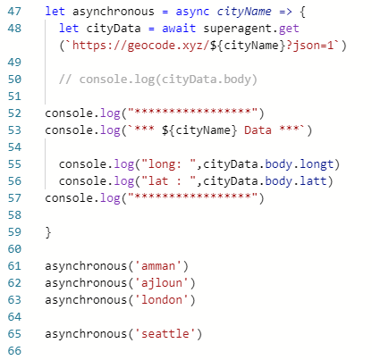

## class _01

### Array.map() =>> 

The map() method in JavaScript creates an array by calling a specific function on each element present in the parent array. It is a non-mutating method. Generally map() method is used to iterate over an array and calling function on every element of array.

==>>  This method is iterate over all elements in the array and return a new array with the same size of the original one even an undefind element

### Array.reduce() =>>

The reduce() method executes a reducer function for each value of an array. reduce() returns a single value which is the function's accumulated result. reduce() does not execute the function for empty array elements. reduce() does not change the original array.

**Definition and Usage**

def => The reduce() method executes a reducer function for each value of an array.
usage  =>

1. reduce() returns a single value which is the function's accumulated result.

2. reduce() does not execute the function for empty array elements.

3. reduce() does not change the original array.

### Superagent()

SuperAgent is light-weight progressive ajax API crafted for flexibility, readability, and a low learning curve after being frustrated with many of the existing request APIs. It also works with Node. js!

**Async  Await  Example =>**

**Then  Example =>**

### Javascript Promise Pattern (promises)

Promises are one way to manage Asynchronous actions. Like a callback, a promise allows you to execute some code and “move on”, allowing for that code to take as long as it needs to run. Unlike a callback

### Are all callback functions considered to be Asynchronous? Why or Why Not?

In general , callback functions are normal functions by the way . So they will not change anything with this concept 

But this depends on the language itself ,  in our course we are studying JavaScript which is a synchronous language by default , So every function writen by this language will be synchronous by default . But we can change and manage it if the project needed .
