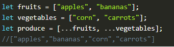
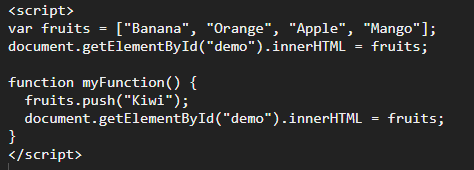
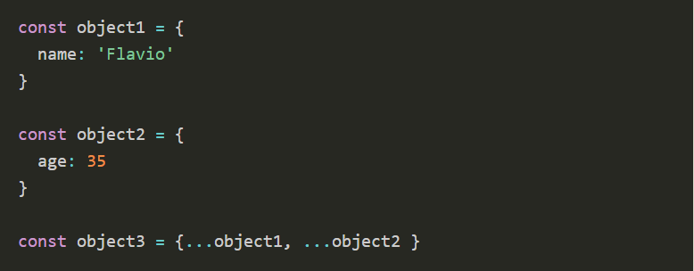

# Lists and Keys
 --------------------------

#### How you transform lists in JavaScript ? we use the map() function to take an array of numbers and double their values.

#### Rendering Multiple Components You can build collections of elements and include them in JSX using curly braces {}.

#### Keys Must Only Be Unique Among Siblings Keys used within arrays should be unique among their siblings. However, they don’t need to be globally unique.

#### Embedding map() in JSX JSX allows embedding any expression in curly braces so we could inline the map()

### The map return a new array from an existing array based on some rules.
### Each list item needs a unique _

### It will need a unique key among other siblings.

### What is the purpose of a key?

### We use keys to make hints to React.

## JavaScript | Spread Operator
 --------------------------

#### Spread operator allows an iterable to expand in places where 0+ arguments are expected. It is mostly used in the variable array where there is more than 1 values are expected. It allows us the privilege to obtain a list of parameters from an array. Syntax of Spread operator is same as Rest parameter but it works completely opposite of it.

#### Note: In order to run the code in this article make use of the console provided by the browser.

## Function Increment()
 --------------------------
#### Increment(): It takes a variable and increments (changes) its value, and also returns this value. The increment can be a positive or negative number.

#### Note: The Increment() function changes the value of its first argument.

## Object.keys
 --------------------------
- The return value is an array of strings.
- is a built-in JavaScript method that returns an array of the given object’s property names.
- Each list item needs a unique a key.
- What is the purpose of a key? to make different between the items,help React identify which items have changed.
- The 👁️obj parameter is required, and its properties are to be returned.

## Examples
 -------------

### Example of using the spread operator to combine two arrays.

### Example of using the spread operator to add a new item to an array. 

### Example of using the spread operator to combine two objects into one.

